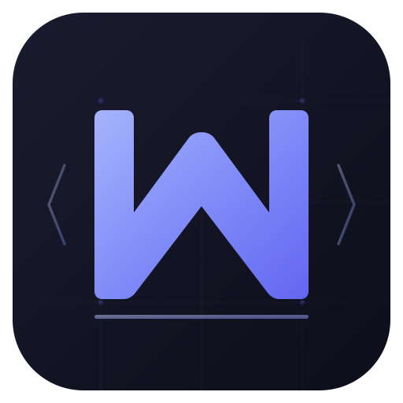

# MarkFlow

<p align="center">
  
</p>

<p align="center">
  <strong>免费开源的 Typora 风格 Markdown 编辑器</strong>
</p>

<p align="center">
  <a href="#"></a>
  <a href="LICENSE"></a>
  <a href="#"></a>
</p>

---

## 为什么选 MarkFlow

Typora 要收费了？MarkFlow 是一个免费、开源的替代品，提供接近 Typora 的编辑体验。

### 核心架构

MarkFlow 使用 **Block-based WYSIWYG** 架构（灵感来自 MarkText/muya）：

- 文档 = 有序的 Block 数组，每个 Block 管理自己的 DOM 和 contenteditable
- 编辑在 Block 级别进行，不需要全文档重新渲染
- 输入模式检测（`###`、\`\`\`、`---` 等）在光标位置原地转换 Block 类型
- 撤销/重做使用 Markdown 快照机制（快照间隔 600ms 防抖）
- 多标签页支持，每个标签独立维护编辑状态

## 功能

### v4.0 新增

| 功能 | 说明 |
|------|------|
| 多标签页 | 同时打开多个文件，`Ctrl+Tab` 切换，中键关闭，右键菜单 |
| 右键菜单 | 编辑区域右键弹出格式化菜单，含快捷键提示 |
| 最近文件 | 侧边栏显示最近打开的文件列表 |
| 查找替换 | Typora 风格浮动面板，支持展开/折叠替换行 |
| 应用图标 | 全新科技感图标，支持 Windows/Mac/Linux |

### 编辑体验

| 功能 | 说明 |
|------|------|
| 所见即所得 | 输入 Markdown，即时看到渲染结果 |
| 源码模式 | `Ctrl+/` 切换，直接编辑 Markdown |
| 代码块创建 | 输入 \`\`\` + Enter，弹出语言选择器（40+ 语言） |
| 语言切换 | 代码块右下角语言标签可点击切换 |
| 列表续行 | Enter 自动续行，空行退出，Tab 缩进 |
| 撤销重做 | `Ctrl+Z` / `Ctrl+Y`，基于 Markdown 快照 |
| 查找替换 | `Ctrl+F` 浮动面板，计数显示，循环搜索 |
| 文档大纲 | `Ctrl+\` 切换侧边栏，按标题层级缩进 |
| 字数统计 | 实时中英文字符/词数统计 |
| 拖放支持 | 拖放 .md 文件到新标签，拖放图片插入 |
| 图片粘贴 | 剪贴板图片自动保存到 images/ 目录 |

### 渲染能力

| 功能 | 技术 |
|------|------|
| 代码高亮 | Highlight.js，190+ 语言 |
| 数学公式 | KaTeX，行内 `$...$` + 块级 `$$...$$` |
| 图表 | Mermaid，流程图/时序图/甘特图等 |
| GFM | 表格、任务列表、删除线 |
| 超链接 | 点击在浏览器打开 |

### 桌面功能

- 文件关联 — `.md` 文件默认打开方式
- 深色/浅色主题 — `Ctrl+Shift+T`
- 导出 HTML / PDF
- 拖放打开 `.md` 文件（新标签）
- 自定义安装目录（Windows）

## 快速开始

### 环境

- [Node.js](https://nodejs.org/) v18+（推荐 v20 LTS）

### 开发

```bash
git clone https://github.com/yourname/markflow.git
cd markflow
npm install
npm start
```

### 构建

```bash
# Windows
npm run build:win

# macOS
npm run build:mac

# Linux
npm run build:linux
```

> 国内加速：`set ELECTRON_MIRROR=https://npmmirror.com/mirrors/electron/`

产物在 `dist/` 目录。

### 安装

**Windows**: 双击 `MarkFlow Setup x.x.x.exe`，选择安装目录，完成后右键 `.md` 文件 → 打开方式 → MarkFlow → 勾选"始终使用"。

**macOS**: 打开 `.dmg`，拖入 Applications。

**Linux**: `chmod +x MarkFlow-x.x.x.AppImage && ./MarkFlow-x.x.x.AppImage`

## 快捷键

| 功能 | Windows/Linux | macOS |
|------|--------------|-------|
| 新建标签 | `Ctrl+N` | `⌘+N` |
| 打开 | `Ctrl+O` | `⌘+O` |
| 保存 | `Ctrl+S` | `⌘+S` |
| 关闭标签 | `Ctrl+W` | `⌘+W` |
| 切换标签 | `Ctrl+Tab` | `⌘+Tab` |
| 加粗 | `Ctrl+B` | `⌘+B` |
| 斜体 | `Ctrl+I` | `⌘+I` |
| 行内代码 | `` Ctrl+` `` | `` ⌘+` `` |
| 超链接 | `Ctrl+K` | `⌘+K` |
| 代码块 | `Ctrl+Shift+K` | `⌘+⇧+K` |
| 查找 | `Ctrl+F` | `⌘+F` |
| 源码模式 | `Ctrl+/` | `⌘+/` |
| 大纲 | `Ctrl+\` | `⌘+\` |
| 主题 | `Ctrl+Shift+T` | `⌘+⇧+T` |
| 专注模式 | `F11` | `F11` |
| 撤销 | `Ctrl+Z` | `⌘+Z` |
| 重做 | `Ctrl+Y` | `⌘+⇧+Z` |

## 项目结构

```
markflow/
├── package.json          # 配置 + electron-builder
├── build/
│   ├── icon.svg          # 应用图标 (SVG 源)
│   ├── icon.png          # 应用图标 (512px)
│   └── icon.ico          # Windows 图标
└── src/
    ├── main.js           # Electron 主进程 (文件 I/O, 菜单, IPC)
    ├── index.html         # 页面布局 (工具栏, 标签栏, 编辑区)
    ├── styles.css         # 样式 (深色/浅色主题, 标签, 查找面板)
    ├── renderer.js        # 渲染进程 (标签管理, 快捷键, 查找替换)
    └── editor/
        ├── Editor.js      # Block-based WYSIWYG 编辑器核心
        ├── parser.js      # Markdown → Block 解析器
        ├── history.js     # 撤销/重做 (快照栈)
        ├── utils.js       # DOM/光标工具函数
        └── langpopup.js   # 语言选择弹窗
```

## 技术栈

| 组件 | 用途 |
|------|------|
| Electron 28 | 跨平台桌面框架 |
| marked 12 | Markdown → HTML |
| highlight.js 11 | 代码语法高亮 |
| KaTeX 0.16 (CDN) | 数学公式渲染 |
| Mermaid 11 (CDN) | 图表渲染 |

## 更新日志

### v4.0.0

- 多标签页支持（Ctrl+N/W/Tab）
- Typora 风格浮动查找替换面板
- 右键上下文菜单
- 最近文件列表
- 全新科技感应用图标
- 代码块内滚轮穿透修复
- 查找输入框焦点丢失修复
- 菜单代码块命令不生效修复
- IPC 架构重构（支持多文件）

### v3.0.0

- Block-based WYSIWYG 编辑器
- 代码块语言选择器
- KaTeX 数学公式 + Mermaid 图表
- 图片插入（工具栏/粘贴/拖放）
- 深色/浅色主题
- 文档大纲 + 字数统计

## License

[MIT](LICENSE)

---

**MarkFlow** — *让 Markdown 写作更愉快*
